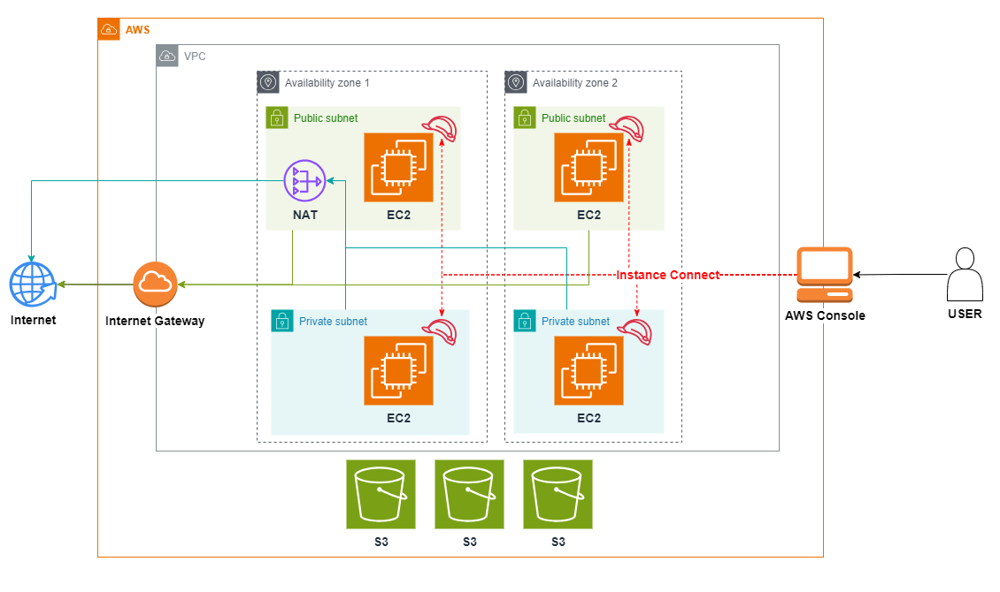

# 專案說明

本專案旨在使用 Terraform 在 AWS 上自動化部署一個包含 VPC、EC2、S3 及網路配置的完整架構。該架構主要設計為多可用區域 (Availability Zones) 的高可用環境，並可用於測試或開發環境。具體架構如下：

- **VPC**: 包含兩個可用區域 (Availability Zones)，每個區域內包含一個公共子網 (Public Subnet) 和一個私有子網 (Private Subnet)。
- **EC2 實例**: 每個可用區域內的公共子網中各部署一台 EC2 實例，用於接收外部流量，並且私有子網中也有 EC2 實例，用於內部服務處理。這些實例將利用 NAT Gateway 進行出站流量的控制，以確保私有子網中的 EC2 實例保持安全。
- **NAT Gateway**: 部署在公共子網中，允許私有子網中的 EC2 實例通過 NAT 出站訪問互聯網，並確保不會暴露在公網中。
- **Internet Gateway**: 用於連接 VPC 與互聯網，並允許部署在公共子網中的 EC2 實例進行外部連接。
- **S3 儲存桶**: 系統使用了多個 S3 儲存桶，這些儲存桶可以用來存儲應用程序數據、備份和靜態資源。
- **Instance Connect**: 透過 AWS Console 使用 Instance Connect 來連接 EC2 實例，進行管理和維護。

該架構適用於測試、開發和小型生產環境，並且透過標籤 (tags) 管理資源，便於成本控制和資源分類。

# 架構圖


# 使用步驟

## 1. 使用前配置
- **IAM 用戶與 AWS CLI 配置：**
  - 在 AWS 上建立一個帶有 `access key` 的 IAM user，該用戶應有足夠的權限管理 EC2、S3 和 VPC。
  - 下載並安裝 [AWS CLI](https://aws.amazon.com/cli/)。
  - 使用 `aws configure` 命令將 IAM user 的 profile 設置在本地環境中。

## 2. 修改 Terraform 配置檔案
進入專案目錄，並依照以下步驟設定 Terraform 配置檔案：

1. **進入 `_variable.tf` 檔案：**
   - 設定 `provider "aws"`，並輸入 AWS 的 `region`。
   - 輸入適合的標籤名稱（tag names）來協助資源管理。
   - 指定 S3 bucket 的名稱。

2. **檢查 EC2 的 AMI 設定：**
   - 確認會使用到的 AMI ID，這些 AMI 會根據你所選擇的 region 而不同。這一點非常重要，因為不同地區有不同的 AMI 可供選擇。
   - 在 `EC2.tf` 中確認每台 EC2 實例都配置了合適的 AMI ID。

## 3. 執行 Terraform 指令
在完成所有設定後，可以按照以下順序執行 Terraform 指令來部署架構：

1. **初始化 Terraform 環境：**
   ```bash
   terraform init
   ```
   該命令會下載並安裝 AWS Provider，並初始化 Terraform 環境。

2. **驗證配置：**
   ```bash
   terraform validate
   ```
   確認你的 Terraform 配置文件語法正確且無誤。

3. **計劃變更：**
   ```bash
   terraform plan
   ```
   該命令會生成變更計劃，幫助你確認哪些資源將會被創建或修改。

4. **應用變更：**
   ```bash
   terraform apply
   ```
   該命令會開始創建並部署所有 AWS 資源。運行後會提示輸入 `yes` 確認變更。

## 4. 測試完成後刪除資源
當測試結束後，為了避免不必要的資源消耗，你可以刪除所有已創建的資源：

```bash
terraform destroy
```
該命令會刪除所有由 Terraform 創建的資源，確保測試環境被完全移除。

